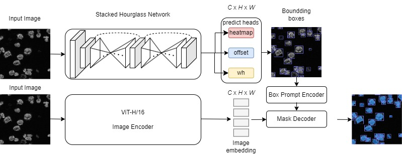
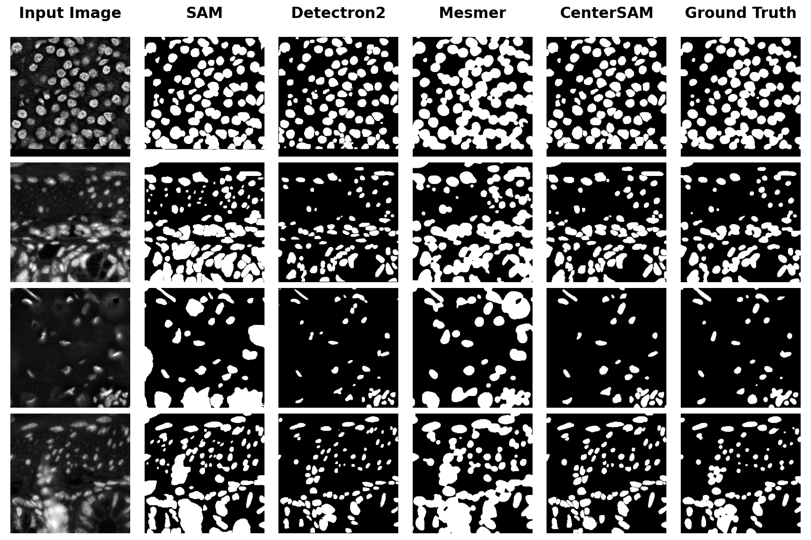

##  Introduction

This is the official github of the paper: **CenterSAM: Fully Automatic Prompt for Dense Nucleus Segmentation.**

The paper has been accepted by **ISBI 2024 (International Symposium on Biomedical Imaging 2024)**, doi TBD.

CenterSAM is a fully automatic prompting segmentation approach which enabling accurate and generalizable nucleus segmentation for biomedical images. The **Figure1** shows the overall archtecture of CenterSAM.

 

**Figure1: Architecture of CenterSAM**

### Evaluation
The method have been evaluated on **three** different sized medical image datasets: 
* [2018 Data Science Bowl](https://www.kaggle.com/c/data-science-bowl-2018) - Represents for **"small"** dataset
  * Number of Images: 51
  * Annotations: 32,217

* [MoNuSeg](https://monuseg.grand-challenge.org/Data/) - Represents for **"medium"** dataset
  * Number of Images: 670
  * Annotations: 29,461

* [TissueNet](https://datasets.deepcell.org/) - Represents for **"large"** dataset
  * Number of Images: 6990
  * Annotations: ~1.2 Million

Below Table shows quantitative results of comparison against State-Of-The-Art (SOTA) methods. The best results are highlighted in bold

<table align="center" style="width:75%">
  <tbody>
    <tr align="center" valign="bottom">
      <td>
        <b></b>
      </td>
      <td>
        <b></b>
      </td>
      <td>
        <b></b>
      </td>
    </tr>
    <tr valign="top">
      <td>
        

<b>2018 Data Science Bowl </b>

          

            <table>
              <tr>
                <th>Method</th>
                <th>DSC(%)↑</th>
                <th>mIoU(%)↑</th>
              </tr>
              <tr>
                <td>UNet++</td>
                <td>91.10</td>
                <td>83.70</td>
              </tr>
              <tr>
                <td>Deeplabv3+ [<a href="https://arxiv.org/abs/1802.02611">paper</a>] [<a href="https://github.com/tensorflow/models/tree/master/research/deeplab">github</a>] </td>
                <td>88.80</td>
                <td>83.70</td>
              </tr>
              <tr>
                <td>SSFormer-S [<a href="https://arxiv.org/abs/2203.03635">paper</a>] [<a href="https://github.com/Qiming-Huang/ssformer">github</a>]</td>
                <td>92.50</td>
                <td>86.50</td>
              </tr>
              <tr>
                <td><b>DuAT</b> [<a href="https://arxiv.org/abs/2212.11677">paper</a>] [<a href="https://github.com/Barrett-python/DuAT">github</a>]</td>
                <td><b>92.60</b></td>
                <td><b>87.00</b></td>
              </tr>
              <tr>
                <td>CenterSAM</td>
                <td>92.20</td>
                <td>86.60</td>
              </tr>
            </table>
          

        

      </td>
      <td>
        

<b>MoNuSeg</b>

          

            <table>
              <!-- <tr>
                <th colspan="3"><b>MoNuSeg</b></th>
              </tr> -->
              <tr>
                <th>Method</th>
                <th>DSC(%)↑</th>
                <th>AJI(%)↑</th>
              </tr>
              <tr>
                <td>UNet</td>
                <td>74.56</td>
                <td>60.22</td>
              </tr>
              <tr>
                <td>UNet++ [<a href="https://arxiv.org/abs/1807.10165">paper</a>] [<a href="https://github.com/MrGiovanni/UNetPlusPlus">github</a>] </td>
                <td>80.33</td>
                <td>67.30</td>
              </tr>
              <tr>
                <td>MAE [<a href="https://arxiv.org/abs/2111.06377">paper</a>] [<a href="https://github.com/facebookresearch/mae">github</a>] </td>
                <td>73.68</td>
                <td>58.62</td>
              </tr>
              <tr>
                <td>MDM [<a href="https://arxiv.org/abs/2308.05695v3.pdf">paper</a>] </td>
                <td>81.01</td>
                <td>68.25</td>
              </tr>
              <tr>
                <td><b>CenterSAM</b></td>
                <td><b>81.95</b></td>
                <td><b>68.75</b></td>
              </tr>
            </table>
          

        

      </td>
      <td>
        

<b>TissueNet</b>

          

            <table>
              <!-- <tr>
                <th colspan="3"><b>TissueNet</b></th>
              </tr> -->
              <tr>
                <th>Method</th>
                <th>DSC(%)↑</th>
                <th>SEG(%)↑</th>
              </tr>
              <tr>
                <td>Detectron2 [<a href="https://github.com/facebookresearch/detectron2/tree/main">github</a>]</td>
                <td>75.50</td>
                <td>78.00</td>
              </tr>
              <tr>
                <td>Cellulus [<a href="https://arxiv.org/abs/2310.08501">paper</a>] [<a href="https://github.com/funkelab/cellulus">github</a>]</td>
                <td>64.10</td>
                <td>52.40</td>
              </tr>
              <tr>
                <td>StarDist [<a href="https://arxiv.org/abs/1806.03535">paper</a>] [<a href="https://github.com/stardist/stardist">github</a>] </td>
                <td>59.40</td>
                <td>38.20</td>
              </tr>
              <tr>
                <td>Mesmer [<a href="https://www.nature.com/articles/s41587-021-01094-0">paper</a>] [<a href="https://github.com/vanvalenlab/deepcell-tf">github</a>]</td>
                <td>83.40</td>
                <td>77.20</td>
              </tr>
              <tr>
                <td><b>CenterSAM</b></td>
                <td><b>88.70</b></td>
                <td><b>79.50</b></td>
              </tr>
            </table>
          

        

      </td>  
    </tr>
  </tbody>
</table>

### Visualization

##  Tutorial

* [Installation](./docs/Environment_setup.md)
* [Dataset Prepare][def1]
* [Quick Start][def]

[def]: ./docs/Quick_Start.md
[def1]: ./docs/Dataset%20Prepare.md